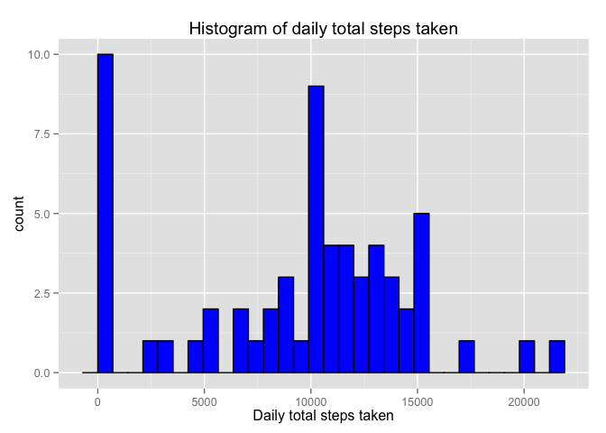
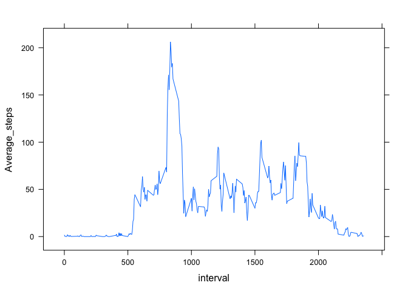
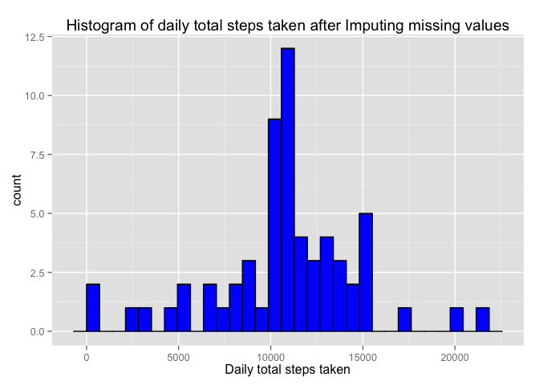
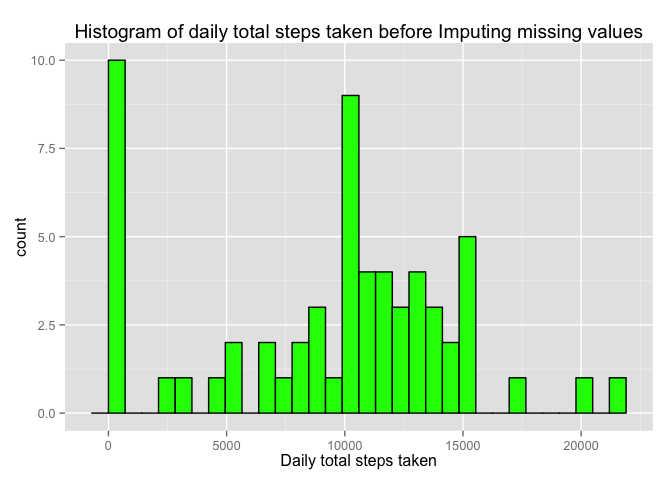
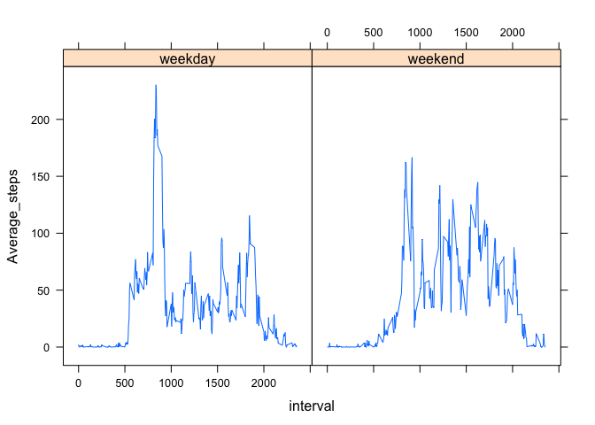

# Reproducible Research: Peer Assessment 1


## Loading and preprocessing the data

### Load the CSV File and view first serveral rows 

```r
activity <- read.csv("~/PA1_QIAN/activity.csv")
```

### Format date

```r
activity$date<-as.POSIXct(activity$date,format="%Y-%m-%d") 
head(activity)
```

```
##   steps       date interval
## 1    NA 2012-10-01        0
## 2    NA 2012-10-01        5
## 3    NA 2012-10-01       10
## 4    NA 2012-10-01       15
## 5    NA 2012-10-01       20
## 6    NA 2012-10-01       25
```

## What is mean total number of steps taken per day?

### Total steps taken per day

```r
#Daily total number of steps by removing missing values
total_daily<-aggregate(activity$steps, by=list(activity$date), FUN=sum,na.rm=TRUE) 
#Rename columns in table
colnames(total_daily)<-c('date','total_steps')  
total_daily
```

```
##          date total_steps
## 1  2012-10-01           0
## 2  2012-10-02         126
## 3  2012-10-03       11352
## 4  2012-10-04       12116
## 5  2012-10-05       13294
## 6  2012-10-06       15420
## 7  2012-10-07       11015
## 8  2012-10-08           0
## 9  2012-10-09       12811
## 10 2012-10-10        9900
## 11 2012-10-11       10304
## 12 2012-10-12       17382
## 13 2012-10-13       12426
## 14 2012-10-14       15098
## 15 2012-10-15       10139
## 16 2012-10-16       15084
## 17 2012-10-17       13452
## 18 2012-10-18       10056
## 19 2012-10-19       11829
## 20 2012-10-20       10395
## 21 2012-10-21        8821
## 22 2012-10-22       13460
## 23 2012-10-23        8918
## 24 2012-10-24        8355
## 25 2012-10-25        2492
## 26 2012-10-26        6778
## 27 2012-10-27       10119
## 28 2012-10-28       11458
## 29 2012-10-29        5018
## 30 2012-10-30        9819
## 31 2012-10-31       15414
## 32 2012-11-01           0
## 33 2012-11-02       10600
## 34 2012-11-03       10571
## 35 2012-11-04           0
## 36 2012-11-05       10439
## 37 2012-11-06        8334
## 38 2012-11-07       12883
## 39 2012-11-08        3219
## 40 2012-11-09           0
## 41 2012-11-10           0
## 42 2012-11-11       12608
## 43 2012-11-12       10765
## 44 2012-11-13        7336
## 45 2012-11-14           0
## 46 2012-11-15          41
## 47 2012-11-16        5441
## 48 2012-11-17       14339
## 49 2012-11-18       15110
## 50 2012-11-19        8841
## 51 2012-11-20        4472
## 52 2012-11-21       12787
## 53 2012-11-22       20427
## 54 2012-11-23       21194
## 55 2012-11-24       14478
## 56 2012-11-25       11834
## 57 2012-11-26       11162
## 58 2012-11-27       13646
## 59 2012-11-28       10183
## 60 2012-11-29        7047
## 61 2012-11-30           0
```

### Histogram of daily total steps taken

```r
library(ggplot2)
qplot(total_daily$total_steps, geom="histogram",
      fill=I("blue"), 
      col=I("black"), 
      main = "Histogram of daily total steps taken", 
      xlab = "Daily total steps taken") 
```

```
## stat_bin: binwidth defaulted to range/30. Use 'binwidth = x' to adjust this.
```

 


### Mean and median of steps taken per day

```r
library(doBy)
```

```
## Loading required package: survival
```

```r
summaryBy(steps ~ date, data = activity, 
          FUN = list(mean,median))
```

```
##          date steps.mean steps.median
## 1  2012-10-01         NA           NA
## 2  2012-10-02  0.4375000            0
## 3  2012-10-03 39.4166667            0
## 4  2012-10-04 42.0694444            0
## 5  2012-10-05 46.1597222            0
## 6  2012-10-06 53.5416667            0
## 7  2012-10-07 38.2465278            0
## 8  2012-10-08         NA           NA
## 9  2012-10-09 44.4826389            0
## 10 2012-10-10 34.3750000            0
## 11 2012-10-11 35.7777778            0
## 12 2012-10-12 60.3541667            0
## 13 2012-10-13 43.1458333            0
## 14 2012-10-14 52.4236111            0
## 15 2012-10-15 35.2048611            0
## 16 2012-10-16 52.3750000            0
## 17 2012-10-17 46.7083333            0
## 18 2012-10-18 34.9166667            0
## 19 2012-10-19 41.0729167            0
## 20 2012-10-20 36.0937500            0
## 21 2012-10-21 30.6284722            0
## 22 2012-10-22 46.7361111            0
## 23 2012-10-23 30.9652778            0
## 24 2012-10-24 29.0104167            0
## 25 2012-10-25  8.6527778            0
## 26 2012-10-26 23.5347222            0
## 27 2012-10-27 35.1354167            0
## 28 2012-10-28 39.7847222            0
## 29 2012-10-29 17.4236111            0
## 30 2012-10-30 34.0937500            0
## 31 2012-10-31 53.5208333            0
## 32 2012-11-01         NA           NA
## 33 2012-11-02 36.8055556            0
## 34 2012-11-03 36.7048611            0
## 35 2012-11-04         NA           NA
## 36 2012-11-05 36.2465278            0
## 37 2012-11-06 28.9375000            0
## 38 2012-11-07 44.7326389            0
## 39 2012-11-08 11.1770833            0
## 40 2012-11-09         NA           NA
## 41 2012-11-10         NA           NA
## 42 2012-11-11 43.7777778            0
## 43 2012-11-12 37.3784722            0
## 44 2012-11-13 25.4722222            0
## 45 2012-11-14         NA           NA
## 46 2012-11-15  0.1423611            0
## 47 2012-11-16 18.8923611            0
## 48 2012-11-17 49.7881944            0
## 49 2012-11-18 52.4652778            0
## 50 2012-11-19 30.6979167            0
## 51 2012-11-20 15.5277778            0
## 52 2012-11-21 44.3993056            0
## 53 2012-11-22 70.9270833            0
## 54 2012-11-23 73.5902778            0
## 55 2012-11-24 50.2708333            0
## 56 2012-11-25 41.0902778            0
## 57 2012-11-26 38.7569444            0
## 58 2012-11-27 47.3819444            0
## 59 2012-11-28 35.3576389            0
## 60 2012-11-29 24.4687500            0
## 61 2012-11-30         NA           NA
```


## What is the average daily activity pattern?

### Average number of steps taken of the 5-minute interval across all days

```r
step_mean_Interval<-aggregate(formula = steps~interval, 
                              data = activity,
                              FUN = mean)
colnames(step_mean_Interval)<-c('interval','Average_steps')
```

### Time series plot 

```r
library("lattice")
xyplot(Average_steps~interval,
       data = step_mean_Interval,
       type = "l")
```

 

### Which 5-minute interval, on average across all the days in the dataset, contains the maximum number of steps?


```r
# The 5-minute interval contains the maximum number of steps is 835
subset(step_mean_Interval,step_mean_Interval$Average_steps==max(step_mean_Interval$Average_steps))
```

```
##     interval Average_steps
## 104      835      206.1698
```


## Imputing missing values

### Missing values

#### Missing values for steps

```r
table(is.na(activity$steps))
```

```
## 
## FALSE  TRUE 
## 15264  2304
```

#### Missing values for date

```r
table(is.na(activity$date))
```

```
## 
## FALSE 
## 17568
```

#### Missing values for interval

```r
table(is.na(activity$interval))
```

```
## 
## FALSE 
## 17568
```

### Replace missing values
#### Merge raw activity data with steps interval average data

```r
steps_imputing<-merge(activity,step_mean_Interval,by="interval")
#Rename columns in table
colnames(steps_imputing)<-c('interval','steps_RAW','date','steps_mean')
head(steps_imputing)
```

```
##   interval steps_RAW       date steps_mean
## 1        0        NA 2012-10-01   1.716981
## 2        0         0 2012-11-23   1.716981
## 3        0         0 2012-10-28   1.716981
## 4        0         0 2012-11-06   1.716981
## 5        0         0 2012-11-24   1.716981
## 6        0         0 2012-11-15   1.716981
```
#### Replace missing steps with average steps and view first several rows

```r
#Initialise the imputing column with original data
steps_imputing$steps_imputing<-steps_imputing$steps_RAW

#Replace missing steps with average steps
steps_imputing$steps_imputing[is.na(steps_imputing$steps_RAW)==TRUE]<-steps_imputing$steps_mean[is.na(steps_imputing$steps_RAW)==TRUE]

head(steps_imputing)
```

```
##   interval steps_RAW       date steps_mean steps_imputing
## 1        0        NA 2012-10-01   1.716981       1.716981
## 2        0         0 2012-11-23   1.716981       0.000000
## 3        0         0 2012-10-28   1.716981       0.000000
## 4        0         0 2012-11-06   1.716981       0.000000
## 5        0         0 2012-11-24   1.716981       0.000000
## 6        0         0 2012-11-15   1.716981       0.000000
```

### Create a new dataset that is equal to the original dataset but with the missing data filled in

```r
activity_no_missing_data<-steps_imputing
```

### The mean and median total number of steps taken per day

```r
library(doBy)
activity_no_missing_data_Daily<-summaryBy(steps_imputing ~ date, data = activity_no_missing_data, 
                                          FUN = list(sum,mean,median))
activity_no_missing_data_Daily
```

```
##          date steps_imputing.sum steps_imputing.mean steps_imputing.median
## 1  2012-10-01           10766.19          37.3825996              34.11321
## 2  2012-10-02             126.00           0.4375000               0.00000
## 3  2012-10-03           11352.00          39.4166667               0.00000
## 4  2012-10-04           12116.00          42.0694444               0.00000
## 5  2012-10-05           13294.00          46.1597222               0.00000
## 6  2012-10-06           15420.00          53.5416667               0.00000
## 7  2012-10-07           11015.00          38.2465278               0.00000
## 8  2012-10-08           10766.19          37.3825996              34.11321
## 9  2012-10-09           12811.00          44.4826389               0.00000
## 10 2012-10-10            9900.00          34.3750000               0.00000
## 11 2012-10-11           10304.00          35.7777778               0.00000
## 12 2012-10-12           17382.00          60.3541667               0.00000
## 13 2012-10-13           12426.00          43.1458333               0.00000
## 14 2012-10-14           15098.00          52.4236111               0.00000
## 15 2012-10-15           10139.00          35.2048611               0.00000
## 16 2012-10-16           15084.00          52.3750000               0.00000
## 17 2012-10-17           13452.00          46.7083333               0.00000
## 18 2012-10-18           10056.00          34.9166667               0.00000
## 19 2012-10-19           11829.00          41.0729167               0.00000
## 20 2012-10-20           10395.00          36.0937500               0.00000
## 21 2012-10-21            8821.00          30.6284722               0.00000
## 22 2012-10-22           13460.00          46.7361111               0.00000
## 23 2012-10-23            8918.00          30.9652778               0.00000
## 24 2012-10-24            8355.00          29.0104167               0.00000
## 25 2012-10-25            2492.00           8.6527778               0.00000
## 26 2012-10-26            6778.00          23.5347222               0.00000
## 27 2012-10-27           10119.00          35.1354167               0.00000
## 28 2012-10-28           11458.00          39.7847222               0.00000
## 29 2012-10-29            5018.00          17.4236111               0.00000
## 30 2012-10-30            9819.00          34.0937500               0.00000
## 31 2012-10-31           15414.00          53.5208333               0.00000
## 32 2012-11-01           10766.19          37.3825996              34.11321
## 33 2012-11-02           10600.00          36.8055556               0.00000
## 34 2012-11-03           10571.00          36.7048611               0.00000
## 35 2012-11-04           10766.19          37.3825996              34.11321
## 36 2012-11-05           10439.00          36.2465278               0.00000
## 37 2012-11-06            8334.00          28.9375000               0.00000
## 38 2012-11-07           12883.00          44.7326389               0.00000
## 39 2012-11-08            3219.00          11.1770833               0.00000
## 40 2012-11-09           10766.19          37.3825996              34.11321
## 41 2012-11-10           10766.19          37.3825996              34.11321
## 42 2012-11-11           12608.00          43.7777778               0.00000
## 43 2012-11-12           10765.00          37.3784722               0.00000
## 44 2012-11-13            7336.00          25.4722222               0.00000
## 45 2012-11-14           10766.19          37.3825996              34.11321
## 46 2012-11-15              41.00           0.1423611               0.00000
## 47 2012-11-16            5441.00          18.8923611               0.00000
## 48 2012-11-17           14339.00          49.7881944               0.00000
## 49 2012-11-18           15110.00          52.4652778               0.00000
## 50 2012-11-19            8841.00          30.6979167               0.00000
## 51 2012-11-20            4472.00          15.5277778               0.00000
## 52 2012-11-21           12787.00          44.3993056               0.00000
## 53 2012-11-22           20427.00          70.9270833               0.00000
## 54 2012-11-23           21194.00          73.5902778               0.00000
## 55 2012-11-24           14478.00          50.2708333               0.00000
## 56 2012-11-25           11834.00          41.0902778               0.00000
## 57 2012-11-26           11162.00          38.7569444               0.00000
## 58 2012-11-27           13646.00          47.3819444               0.00000
## 59 2012-11-28           10183.00          35.3576389               0.00000
## 60 2012-11-29            7047.00          24.4687500               0.00000
## 61 2012-11-30           10766.19          37.3825996              34.11321
```

### Histogram of the total number of steps taken each day before and after Imputing missing values

```r
#Histogram of daily total steps taken after Imputing missing values
library(ggplot2)
qplot(activity_no_missing_data_Daily$steps_imputing.sum, geom="histogram",
      fill=I("blue"), 
      col=I("black"), 
      main = "Histogram of daily total steps taken after Imputing missing values", 
      xlab = "Daily total steps taken") 
```

```
## stat_bin: binwidth defaulted to range/30. Use 'binwidth = x' to adjust this.
```

 

```r
#Histogram of daily total steps taken before Imputing missing values
library(ggplot2)
qplot(total_daily$total_steps, geom="histogram",
      fill=I("green"), 
      col=I("black"), 
      main = "Histogram of daily total steps taken before Imputing missing values", 
      xlab = "Daily total steps taken") 
```

```
## stat_bin: binwidth defaulted to range/30. Use 'binwidth = x' to adjust this.
```

 

## Are there differences in activity patterns between weekdays and weekends?

### Add weekday and weekday/weekedn flags to the data

```r
activity_no_missing_data$date<-as.POSIXct(activity_no_missing_data$date,format="%Y-%m-%d")
#Add weekday flags and view first several rows
activity_no_missing_data$weekday<-weekdays(activity_no_missing_data$date)
head(activity_no_missing_data)
```

```
##   interval steps_RAW       date steps_mean steps_imputing  weekday
## 1        0        NA 2012-10-01   1.716981       1.716981   Monday
## 2        0         0 2012-11-23   1.716981       0.000000   Friday
## 3        0         0 2012-10-28   1.716981       0.000000   Sunday
## 4        0         0 2012-11-06   1.716981       0.000000  Tuesday
## 5        0         0 2012-11-24   1.716981       0.000000 Saturday
## 6        0         0 2012-11-15   1.716981       0.000000 Thursday
```

```r
#Add weekday/weekend flags and view first several rows
activity_no_missing_data$weekday_weekend_Flag<-"weekday"
activity_no_missing_data$weekday_weekend_Flag[activity_no_missing_data$weekday %in% c("Saturday", "Sunday")]<-"weekend"
head(activity_no_missing_data)
```

```
##   interval steps_RAW       date steps_mean steps_imputing  weekday
## 1        0        NA 2012-10-01   1.716981       1.716981   Monday
## 2        0         0 2012-11-23   1.716981       0.000000   Friday
## 3        0         0 2012-10-28   1.716981       0.000000   Sunday
## 4        0         0 2012-11-06   1.716981       0.000000  Tuesday
## 5        0         0 2012-11-24   1.716981       0.000000 Saturday
## 6        0         0 2012-11-15   1.716981       0.000000 Thursday
##   weekday_weekend_Flag
## 1              weekday
## 2              weekday
## 3              weekend
## 4              weekday
## 5              weekend
## 6              weekday
```

### 5-minute interval and the average number of steps taken, averaged across all weekday days or weekend days

```r
step_mean_weekday_weekend<-aggregate(formula = steps_imputing~interval+weekday_weekend_Flag, 
                                     data = activity_no_missing_data,
                                     FUN = mean)
colnames(step_mean_weekday_weekend)<-c('interval','weekday_weekend_Flag','Average_steps')
```

### Panel plot containing a time series plot for weekday and weekend

```r
library("lattice")
xyplot(Average_steps~interval|weekday_weekend_Flag,
       data = step_mean_weekday_weekend,
       type = "l")
```

 
